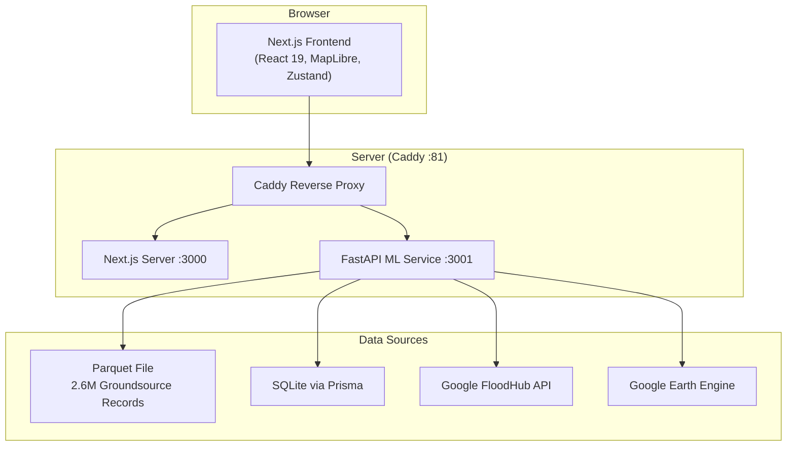
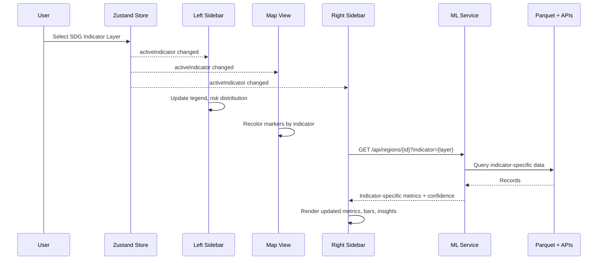

# Design Document: AquaSDG UI & Data Overhaul

## Overview

This design describes the comprehensive overhaul of the AquaSDG platform to transform it from a demo-data prototype into a production-ready, real-data-driven water security intelligence system. The overhaul spans three layers:

1. **Frontend UI fixes** — scrolling, tooltips, button visibility, indicator-aware panels
2. **Data pipeline** — replacing hardcoded mock data with real groundsource parquet records and live Google API feeds (FloodHub, Earth Engine)
3. **Feature additions** — PDF export, flood visualization, error boundaries, caching, Data Explorer enhancements

The existing architecture (Next.js 16 + React 19 frontend, Python FastAPI ML service, Prisma SQLite, Caddy reverse proxy) is preserved. Changes are additive — new API endpoints, enhanced components, and a richer Zustand store — rather than a rewrite.

## Architecture

### System Context



### Data Flow for Indicator-Aware UI



## Components and Interfaces

### 1. Zustand Store Enhancement (`src/lib/aquasdg-store.ts`)

Add the following fields to the existing store:

```typescript
interface AquaSDGState {
  // ... existing fields ...

  // NEW: Active SDG indicator layer
  activeIndicator: IndicatorType | 'overall';
  setActiveIndicator: (indicator: IndicatorType | 'overall') => void;

  // NEW: Data cache (region+indicator -> data)
  dataCache: Map<string, { data: any; timestamp: number }>;
  setCacheEntry: (key: string, data: any) => void;
  getCacheEntry: (key: string, ttlMs?: number) => any | null;
  clearCache: () => void;

  // NEW: Service status
  serviceStatus: 'connected' | 'degraded' | 'offline';
  setServiceStatus: (status: 'connected' | 'degraded' | 'offline') => void;

  // NEW: Data source statuses
  dataSources: Record<string, { status: 'live' | 'demo' | 'error'; recordCount: number; lastUpdated: string }>;
  setDataSourceStatus: (source: string, status: any) => void;
}
```

### 2. ML Service API Enhancements (`mini-services/ml-service/index.py`)

New and modified endpoints:

| Endpoint | Method | Description |
|----------|--------|-------------|
| `GET /api/regions` | GET | Enhanced: returns indicator-specific risk levels, supports `?indicator=` param |
| `GET /api/regions/{id}` | GET | Enhanced: returns confidence scores, data source breakdown |
| `GET /api/regions/{id}/indicators/{indicator}` | GET | NEW: indicator-specific deep data for a region |
| `GET /api/groundsource/records` | GET | NEW: paginated groundsource records with filters |
| `GET /api/groundsource/stats` | GET | NEW: aggregate statistics from parquet data |
| `GET /api/floodhub/forecasts` | GET | NEW: FloodHub flood forecasts (requires API key) |
| `GET /api/floodhub/alerts` | GET | NEW: active flood alerts |
| `GET /api/data-sources/status` | GET | NEW: connection status for all data sources |
| `POST /api/reports/generate` | POST | Enhanced: comprehensive report with enhanced prompt |
| `POST /api/reports/pdf` | POST | NEW: PDF generation from report content |

### 3. Parquet Data Loader (`mini-services/ml-service/groundsource_loader.py`)

New module for loading and querying the 636MB parquet file:

```python
class GroundsourceLoader:
    """Loads and indexes the groundsource parquet file for efficient querying."""
    
    def __init__(self, parquet_path: str):
        self.df: pd.DataFrame  # Lazy-loaded
        self.region_index: Dict[str, pd.DataFrame]  # Pre-grouped by region
    
    def load(self) -> None:
        """Load parquet with column pruning for memory efficiency."""
    
    def query_region(self, region_id: str, filters: dict) -> List[dict]:
        """Query records for a specific region with optional filters."""
    
    def compute_indicators(self, region_id: str) -> dict:
        """Compute indicator values from real data for a region."""
    
    def get_statistics(self) -> dict:
        """Compute global aggregate statistics."""
    
    def get_paginated_records(self, page: int, size: int, filters: dict) -> dict:
        """Return paginated records with total count."""
```

### 4. Google API Integration (`mini-services/ml-service/google_apis.py`)

New module for FloodHub and Earth Engine integration:

```python
class GoogleDataClient:
    """Manages connections to Google FloodHub and Earth Engine APIs."""
    
    def __init__(self, api_key: str = None, service_account_path: str = None):
        self.floodhub_available: bool
        self.earth_engine_available: bool
    
    def get_flood_forecasts(self, lat: float, lng: float, radius_km: float) -> List[dict]:
        """Fetch flood forecasts from FloodHub API."""
    
    def get_flood_alerts(self) -> List[dict]:
        """Fetch active flood alerts globally."""
    
    def get_satellite_water_data(self, region_bounds: dict) -> dict:
        """Fetch water body extent and vegetation indices from Earth Engine."""
    
    def get_precipitation_data(self, lat: float, lng: float, days: int) -> List[dict]:
        """Fetch precipitation history from Earth Engine."""
    
    def get_source_status(self) -> dict:
        """Return connection status for all Google data sources."""
```

### 5. UI Component Changes

#### Map Tooltip Redesign (`src/components/aquasdg/map-view.tsx`)

Current tooltip has an oversized bright blue AI analysis button and clipped icons. The redesigned tooltip:

- Compact card with dark slate background (`bg-slate-900/95`)
- Region name + country in header
- Risk level badge with indicator-specific color
- 3 most relevant metrics for the current indicator layer (from `INDICATOR_CONFIG.nuancedMetrics`)
- Small "View Details" text link instead of large button
- All icons sized to `w-3.5 h-3.5` with proper `overflow-hidden` containment

#### Scrollable Panels

All panels get `overflow-y-auto` or use shadcn `ScrollArea`:

- **Left Sidebar**: Wrap content in `<ScrollArea className="h-[calc(100vh-4rem)]">`
- **Right Sidebar**: Same ScrollArea wrapper
- **Policy Intelligence**: Each phase panel wrapped in ScrollArea
- **Data Explorer**: Records list in ScrollArea with sticky header

#### Policy Intelligence Fixes (`src/components/aquasdg/policy-intelligence.tsx`)

- "Back to Implementation" button: change from `text-white bg-white` to `text-slate-900 bg-white` or `text-white bg-cyan-600`
- Stakeholder Mapping phase: replace hardcoded stakeholders with a curated database of real international water organizations (UNICEF WASH, WHO/UNICEF JMP, World Bank Water GP, WaterAid, IRC WASH, local government water ministries) with real URLs
- Report generation: enhanced system prompt with structured sections, data citations, and professional formatting
- PDF export: use `html2pdf.js` or `jsPDF` to convert the rendered report to downloadable PDF

#### Indicator Bars (`src/app/page.tsx` — Right Sidebar)

Currently static. Change to:
- Read `activeIndicator` from Zustand store
- Compute bar color from `INDICATOR_CONFIG[activeIndicator].colorScale`
- Compute bar value from `region.indicators[activeIndicator]`
- Show indicator-specific label and unit

#### Flood Event Layer (`src/components/aquasdg/map-view.tsx`)

- Add a MapLibre source+layer for flood events as circle markers with severity-coded radius and color
- Toggle visibility based on `activeIndicator === 'flood_risk'` or explicit toggle
- Tooltip on hover shows event date, severity, affected area

### 6. Error Boundary Component (`src/components/aquasdg/error-boundary.tsx`)

```typescript
// React error boundary wrapping each major panel
interface ErrorBoundaryProps {
  fallback: React.ReactNode;
  children: React.ReactNode;
  onError?: (error: Error) => void;
}
```

Wrap: MapView, PolicyIntelligence, GroundsourceExplorer, Left/Right sidebars.

### 7. Data Caching Strategy

- Frontend: Zustand store `dataCache` map with 5-minute TTL
- Cache key format: `${regionId}:${indicator}:${filterHash}`
- React Query (`@tanstack/react-query`) already in dependencies — use its built-in caching with `staleTime: 5 * 60 * 1000`
- Manual refresh button clears React Query cache for the active queries

### 8. PDF Export (`src/lib/aquasdg/pdf-export.ts`)

```typescript
export async function generatePolicyPDF(report: {
  title: string;
  region: string;
  content: string;
  metadata: Record<string, any>;
}): Promise<Blob> {
  // Uses jsPDF + html2canvas to render the report HTML to PDF
}
```

## Data Models

### Enhanced Region Response (ML Service)

```python
class EnhancedRegionResponse(BaseModel):
    id: str
    name: str
    country: str
    coordinates: dict
    population: int
    risk_level: str  # Now indicator-specific
    indicators: dict  # All 9 indicator values
    active_indicator_detail: dict  # Deep data for the requested indicator
    confidence: dict  # { score: float, data_coverage: float, sources: list }
    data_sources: list  # Which sources contributed to this region's data
    flood_events: list  # Recent flood events if any
    flood_alerts: list  # Active FloodHub alerts if any
```

### Groundsource Record (for Data Explorer)

```python
class GroundsourceRecord(BaseModel):
    id: str
    region_name: str
    country: str
    latitude: float
    longitude: float
    event_date: str
    severity: float
    affected_area_km2: float
    data_source: str
    source_url: Optional[str]
    indicator_type: str
    raw_value: float
```

### Paginated Response

```python
class PaginatedResponse(BaseModel):
    records: List[GroundsourceRecord]
    total: int
    page: int
    page_size: int
    has_next: bool
    insights: dict  # { avg_severity, temporal_distribution, top_regions }
```

### Stakeholder Database Entry

```typescript
interface Stakeholder {
  name: string;
  type: 'government' | 'ngo' | 'multilateral' | 'funding' | 'community';
  role: string;
  organization: string;
  url: string;           // Real public URL
  contactEmail?: string; // Public contact
  engagement: 'high' | 'medium' | 'low';
  relevantIndicators: IndicatorType[];
}
```

### Report Generation Request

```python
class ReportGenerationRequest(BaseModel):
    region_id: str
    indicator: str
    interventions: List[str]
    budget: float
    time_horizon_years: int
    include_stakeholders: bool = True
    include_flood_analysis: bool = True
```

## Correctness Properties

*A property is a characteristic or behavior that should hold true across all valid executions of a system — essentially, a formal statement about what the system should do. Properties serve as the bridge between human-readable specifications and machine-verifiable correctness guarantees.*

### Property 1: Tooltip displays indicator-specific metrics

*For any* region and *for any* selected SDG indicator layer, the map tooltip content SHALL contain the region name, country, risk level badge, and exactly the top 3 nuanced metrics defined in `INDICATOR_CONFIG[activeIndicator].nuancedMetrics`.

**Validates: Requirements 3.1**

### Property 2: Left sidebar legend matches selected indicator

*For any* SDG indicator selection, the legend color scale and label SHALL match the `colorScale` and `name` defined in `INDICATOR_CONFIG` for that indicator.

**Validates: Requirements 4.1**

### Property 3: Right sidebar metrics match selected indicator

*For any* region and *for any* SDG indicator selection, the metrics displayed in the right sidebar SHALL correspond to the `nuancedMetrics` array for the selected indicator, with values sourced from the region's indicator data.

**Validates: Requirements 4.2**

### Property 4: Indicator bars reflect selected indicator and region

*For any* region and *for any* SDG indicator, the indicator bar color SHALL be derived from `INDICATOR_CONFIG[indicator].colorScale` and the bar value SHALL equal `region.indicators[indicator]`.

**Validates: Requirements 4.4**

### Property 5: Store persists indicator and notifies subscribers

*For any* indicator value set via `setActiveIndicator`, reading `activeIndicator` from the store SHALL return that same value, and all store subscribers SHALL be notified of the change.

**Validates: Requirements 4.5, 13.2**

### Property 6: Real data regions return groundsource-derived indicators

*For any* region ID that has matching records in the groundsource parquet data, the API response SHALL return indicator values computed from those records (not from the hardcoded `REGIONS_DATA`).

**Validates: Requirements 5.2**

### Property 7: Paginated API results satisfy filter criteria and pagination invariants

*For any* page number, page size, and filter combination, all returned records SHALL satisfy the filter criteria, the number of returned records SHALL be ≤ page_size, and `has_next` SHALL be true if and only if `(page * page_size) < total`.

**Validates: Requirements 5.3**

### Property 8: Missing-data regions fall back to demo source

*For any* region ID that has zero matching records in the groundsource data, the API response SHALL include `data_source: "demo"` and return values from the fallback mock data.

**Validates: Requirements 5.4**

### Property 9: Multi-source data merge preserves all source fields

*For any* region with data from multiple sources (groundsource + Google APIs), the merged result SHALL contain fields from all contributing sources, and no source's data SHALL be dropped during the merge.

**Validates: Requirements 5.8**

### Property 10: Stakeholder URLs are valid HTTP(S) URLs

*For any* stakeholder entry in the stakeholder database, the `url` field SHALL be a valid HTTP or HTTPS URL that matches the pattern `^https?://`.

**Validates: Requirements 6.2**

### Property 11: Risk distribution recalculates per indicator

*For any* SDG indicator and *for any* set of regions, the risk level distribution counts SHALL be computed using that indicator's value and thresholds, and the sum of all risk level counts SHALL equal the total number of regions.

**Validates: Requirements 7.1**

### Property 12: Confidence scores reflect data coverage

*For any* region, the confidence score SHALL be proportional to the number of real data records available for that region divided by the expected record count, bounded between 0.0 and 1.0.

**Validates: Requirements 7.2**

### Property 13: Risk filter uses indicator-specific classification

*For any* SDG indicator and *for any* risk level filter selection, all regions passing the filter SHALL have a risk classification for that specific indicator that matches the selected risk level.

**Validates: Requirements 7.3**

### Property 14: Flood event tooltip shows all required fields

*For any* flood event, the tooltip content SHALL contain the event date, severity value, affected area in km², and data source name.

**Validates: Requirements 8.2**

### Property 15: Error handler produces contextual messages with retry

*For any* failed API request, the error handler SHALL produce a message containing the endpoint name and SHALL include a retry callback function.

**Validates: Requirements 9.1**

### Property 16: Error boundary renders fallback on child error

*For any* React component wrapped in an error boundary, if the child throws a rendering error, the error boundary SHALL render the fallback UI instead of crashing the parent.

**Validates: Requirements 9.2**

### Property 17: Cache stores, serves within TTL, and expires after TTL

*For any* data fetch, the cache SHALL store the response. A subsequent request within the TTL SHALL return the cached data without a new fetch. A request after the TTL SHALL trigger a fresh fetch and update the cache.

**Validates: Requirements 10.1, 10.2, 10.3**

### Property 18: Data Explorer filtered results match filter criteria

*For any* filter combination (country, date range, severity threshold, indicator type), all records returned by the Data Explorer SHALL satisfy every applied filter criterion.

**Validates: Requirements 11.2**

### Property 19: Data Explorer source links rendered as hyperlinks

*For any* record that has a non-null `source_url`, the rendered Data Explorer row SHALL contain a clickable anchor element with `href` equal to that URL and `target="_blank"`.

**Validates: Requirements 11.3**

### Property 20: Data Explorer summary insights contain required fields

*For any* non-empty set of filtered records, the summary insights SHALL include: record count (equal to the number of records), average severity (equal to the mean of severity values), and a list of top affected regions.

**Validates: Requirements 11.4**

### Property 21: Flood alert badges shown for alerted regions

*For any* region that has one or more active flood alerts, the UI SHALL render an alert badge on that region's marker and in the right sidebar.

**Validates: Requirements 12.2**

### Property 22: Flood display includes SDG 6 analysis overlay

*For any* region with flood data displayed, the rendered content SHALL include SDG 6 metrics: water access rate, sanitation infrastructure status, and policy response readiness score.

**Validates: Requirements 12.3**

### Property 23: Store cache keyed by region and indicator

*For any* region ID and indicator type pair, setting a cache entry with key `${regionId}:${indicator}` and then retrieving it with the same key SHALL return the stored data. Setting a different key SHALL not affect the first entry.

**Validates: Requirements 13.3**

## Error Handling

### Frontend Error Handling

| Error Type | Handling Strategy |
|-----------|-------------------|
| ML Service unreachable | Show service status banner, serve cached data, retry with exponential backoff |
| API request timeout | Show timeout message with retry button, log to console |
| Component render error | Error boundary catches, shows fallback UI with "Retry" button |
| Invalid API response | Validate with Zod schemas, show "Data format error" with raw response in dev mode |
| Google API key invalid | Show "API key invalid" in data source status, fall back to demo data |
| Parquet file missing | ML Service logs warning, serves only mock data, reports "demo" status |

### Backend Error Handling

| Error Type | Handling Strategy |
|-----------|-------------------|
| Parquet load failure | Log error, set groundsource status to "error", serve mock data |
| FloodHub API error | Log error, set FloodHub status to "error", continue without flood data |
| Earth Engine auth failure | Log error, set EE status to "error", continue without satellite data |
| Region not found | Return 404 with descriptive message |
| Invalid filter params | Return 422 with validation error details |
| PDF generation failure | Return 500 with error message, suggest retrying |

### Error Response Format

```python
class ErrorResponse(BaseModel):
    error: str
    detail: str
    endpoint: str
    retry_after_seconds: Optional[int] = None
```

## Testing Strategy

### Dual Testing Approach

This project uses both unit tests and property-based tests for comprehensive coverage:

- **Unit tests**: Verify specific examples, edge cases, button visibility fixes, CSS class assertions
- **Property-based tests**: Verify universal properties across all valid inputs using randomized generation

### Property-Based Testing Configuration

- **Library**: `fast-check` (already in `node_modules`) for TypeScript frontend tests
- **Library**: `hypothesis` for Python ML service tests
- **Minimum iterations**: 100 per property test
- **Tag format**: `Feature: aquasdg-ui-data-overhaul, Property {N}: {title}`

### Frontend Tests (TypeScript + fast-check)

| Test | Type | Properties Covered |
|------|------|-------------------|
| Tooltip content for any region/indicator | Property | P1 |
| Legend config matches indicator | Property | P2 |
| Right sidebar metrics for any indicator | Property | P3 |
| Indicator bar color/value computation | Property | P4 |
| Zustand store indicator persistence | Property | P5 |
| Risk distribution calculation | Property | P11 |
| Risk filter correctness | Property | P13 |
| Error boundary fallback rendering | Property | P16 |
| Cache TTL behavior | Property | P17 |
| Data Explorer filter matching | Property | P18 |
| Source link rendering | Property | P19 |
| Summary insights computation | Property | P20 |
| Flood alert badge rendering | Property | P21 |
| SDG 6 overlay content | Property | P22 |
| Store cache key isolation | Property | P23 |
| .gitignore contains required patterns | Unit | Req 1.2 |
| "Back to Implementation" button contrast | Unit | Req 6.3 |
| PDF export produces valid Blob | Unit | Req 6.5 |
| Store initial state | Unit | Req 13.1 |

### Backend Tests (Python + hypothesis)

| Test | Type | Properties Covered |
|------|------|-------------------|
| Real data regions return computed indicators | Property | P6 |
| Pagination invariants | Property | P7 |
| Fallback to demo for missing regions | Property | P8 |
| Multi-source merge completeness | Property | P9 |
| Stakeholder URL validation | Property | P10 |
| Confidence score bounds | Property | P12 |
| Flood tooltip field completeness | Property | P14 |
| Error response format | Property | P15 |

### Test File Structure

```
src/__tests__/
  tooltip.property.test.ts       # P1
  indicator-config.property.test.ts  # P2, P3, P4
  store.property.test.ts         # P5, P23
  risk-filter.property.test.ts   # P11, P13
  error-boundary.property.test.ts # P16
  cache.property.test.ts         # P17
  data-explorer.property.test.ts # P18, P19, P20
  flood-ui.property.test.ts      # P21, P22
  unit/
    button-contrast.test.ts
    pdf-export.test.ts
    gitignore.test.ts

mini-services/ml-service/tests/
  test_groundsource_loader.py    # P6, P7, P8
  test_data_merge.py             # P9
  test_stakeholders.py           # P10
  test_confidence.py             # P12
  test_flood_tooltip.py          # P14
  test_error_handling.py         # P15
```
